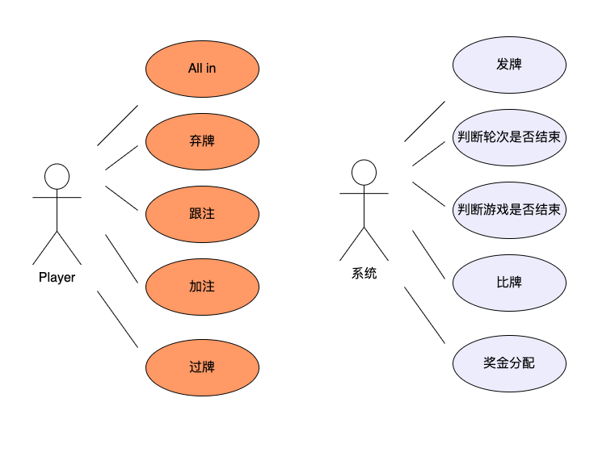
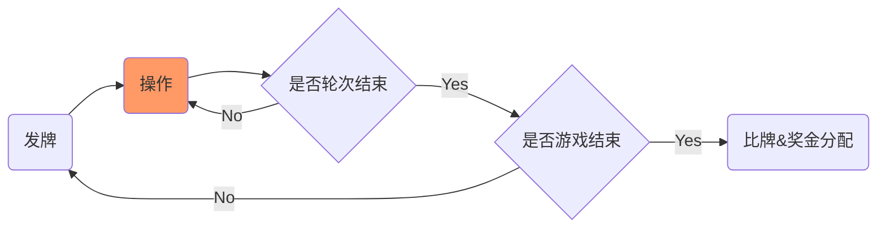

## 德州扑克

[toc]

### 目标

在给定的规则约束下，用尽量少的语言使读者能够理解清楚德州扑克的游戏规则；各种场景都能在本文中找到线索并推论出最终结果。

### 概述

德州扑克一共有52张牌，没有王牌。一局游戏由2-10名玩家组成，每名玩家经过系统发牌后开始依次下注。4轮过后，若仍不能分出胜负，游戏会进入“摊牌”阶段，也就是让所剩的玩家亮出各自的底牌以较高下，持大牌者获胜并赢得奖金。

### 规则约束（有可能和真实的规则不符）

1. 大盲注投注金额为小盲注2倍
2. 每一轮最小下注金额为￥10
3. All in的金额不能小于上一名玩家下注的金额
4. 每次加注，增加的部分为￥10
5. 每轮最多只能加注3次

### 角色及功能拆分

### 系统

#### 发牌

游戏最多会经历4轮发牌

- 第一轮：从小盲注开始顺时针方向每人发两张底牌，牌面朝下
- 第二轮（翻牌）：切掉一张牌，桌面上发出三张公共牌，牌面朝上
- 第三轮（转牌）：切掉一张牌，发出第四张公共牌，牌面朝上
- 第四轮（河牌）：发出第五张公共牌，牌面朝上

#### 游戏结束的判断

1. 任何一个轮次只剩一名玩家
2. 第四轮比牌过后

#### 玩家离开轮次的判断

1. 玩家主动弃牌
2. 玩家剩余的筹码金额小于上一名玩家下注金额

#### 轮次结束的判断

1. 若本轮无人加注，且所有玩家为跟注或者弃牌，则轮次结束
2. 若本轮有人加注，除最后一个加注玩家外，所有玩家都为跟注（投注金额等于最后一个加注玩家的下注金额）或者弃牌，则轮次结束
3. 一个轮次最多只能加注3次

#### 比牌

- 规则：http://sports.163.com/special/poker_rule/
- 剩余玩家（未弃牌）根据底牌+公共牌任意选择5张牌组合。

#### 奖金分配

1. 若场上只剩余一名玩家，则获得全部筹码
2. 若拥有最佳组合的玩家没有在之前轮次All in，且只有一位，则获得全部筹码
3. 若拥有最佳组合的玩家没有在之前轮次All in，且有多名，则平均分配全部筹码，例如：大家都选择公共牌作为组合
4. 若拥有最佳组合的玩家在之前轮次All in，该玩家赢得当时的筹码金额，剩余玩家按照1-2的规则分配奖金
5. 若有多名玩家在之前轮次All in，且牌面大过剩余玩家，则按照牌面大小，依次获得当时奖池金额，剩余玩家按照1-2的规则分配奖金。注：如果后All in的玩家牌面打过先All in玩家的牌面，则先All in的玩家相当于弃牌。例：
   1. A第一轮All in，B第二轮All in。A牌面>B>剩余，则A赢第一轮的金额，B赢第二轮 - 第一轮的金额，剩余玩家再分
   2. A第一轮All in，B第二轮All in。B牌面>A>剩余，则A一分钱不赢，B赢第二轮，剩余玩家再分

### 玩家

- 庄家：每一轮下注时，最后一个行动的玩家。当一局牌局结束后，庄家按照顺时针方向下移一位。
- 小盲注：庄家左手边第一名玩家，第一轮第一个下注且能弃牌
- 大盲注：庄家左手边第二名玩家，第一轮第二个下注，下注金额为小盲注的2倍
- 普通玩家
- 一局游戏由2-10名玩家组成

#### 玩家的操作

- All in：金额不能小于上一名玩家下注的金额。All in之后不再参与每一轮的下注，若该玩家最终获胜，所赢金额为此刻奖池中的金额。剩余的奖金由剩余玩家按照规则进行分配。
- 弃牌：放弃本局游戏，损失投注金额
- 跟注：和上一名玩家下注相同的筹码，下注金额不能超过剩余筹码金额
- 加注：下注的金额为上一名玩家下注的金额+￥10，下注金额不能超过剩余筹码金额，一个轮次最多只能加注3次，每轮第一名玩家不能加注。
- 过牌：跳过给下一名玩家行动。
  - 若在一圈内，无其他玩家过牌，且为最后一个行动的玩家时不能过牌
  - 若在一圈内，玩家已经过了一次牌，轮到该玩家时不能过牌
  - 每一圈在所有玩家都下注后（除了过牌），才有可能进入下一圈
  - 注：一局游戏有4个轮次，一个轮次可能有很多圈
- 操作的顺序：从小盲注开始顺时针依次操作

### 游戏进程

问题：两个人玩，A：20，B：+40，A：跟。+20 or 40？我认为20。。但是炸金花好像是40？